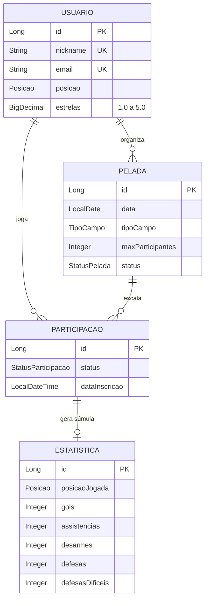

# Agressores da Bola

API REST para organização de peladas: cadastro de jogadores, agendamento de partidas,
controle de escalação, súmula estatística, rankings de pontuação e sorteio de times
equilibrados por nível técnico.

[](https://openjdk.org/projects/jdk/25/)
[](https://spring.io/projects/spring-boot)
[](https://dev.mysql.com/doc/)
[](https://maven.apache.org/)

---

## Sumário

- [Sobre](#sobre)
- [Stack](#stack)
- [Arquitetura](#arquitetura)
- [Modelo de domínio](#modelo-de-domínio)
- [Configuração e execução](#configuração-e-execução)
- [Documentação interativa](#documentação-interativa)
- [Frontend](#frontend)
- [Segurança](#segurança)
- [API](#api)
  - [Usuários](#usuários)
  - [Peladas](#peladas)
  - [Escalação](#escalação)
  - [Estatísticas](#estatísticas)
  - [Rankings](#rankings)
  - [Sorteio de times](#sorteio-de-times)
- [Regras de negócio](#regras-de-negócio)
- [Tabela de pontuação](#tabela-de-pontuação)
- [Algoritmo de sorteio](#algoritmo-de-sorteio)
- [Paginação, filtros e ordenação](#paginação-filtros-e-ordenação)
- [Tratamento de erros](#tratamento-de-erros)
- [Testes](#testes)
- [Roadmap](#roadmap)
- [Referências](#referências)

---

## Sobre

O projeto resolve o ciclo completo de uma pelada recreativa:

| Etapa | O que a API faz |
|---|---|
| **Cadastro** | Jogadores com posição, dados de contato e nível técnico em estrelas |
| **Agendamento** | Peladas com local, horário, tipo de campo, limite de vagas e valor por jogador |
| **Escalação** | Convite, confirmação, lista de espera com promoção automática |
| **Sorteio** | Divisão em times equilibrados pela soma de estrelas, com goleiros distribuídos |
| **Súmula** | Gols, assistências, desarmes, defesas e defesas difíceis por jogador e por partida |
| **Rankings** | Classificação geral por pontos e rankings individuais por atributo |

---

## Stack

| Camada | Tecnologia |
|---|---|
| Linguagem | Java 25 |
| Framework | Spring Boot 4.1.0 (Web MVC, Data JPA, Validation) |
| Persistência | Hibernate ORM / JPA, MySQL 8 |
| Consultas dinâmicas | JPA Criteria API via `Specification` |
| Documentação da API | springdoc-openapi 3.1.1 (OpenAPI 3.1 + Swagger UI) |
| Frontend | Angular 22 + Tailwind CSS 4, com cliente gerado do contrato OpenAPI |
| Boilerplate | Lombok |
| Build | Maven Wrapper |
| Testes | JUnit 5, AssertJ, slices de teste do Spring Boot |

---

## Arquitetura

Camadas com dependência em sentido único — `controller → service → repository` — e os
DTOs isolando o contrato HTTP das entidades JPA. Nenhuma entidade é serializada
diretamente na resposta.

```
com.hmz.agressores_da_bola
├── controller/    endpoints REST, validação de entrada, códigos HTTP
├── service/       contratos de caso de uso (interfaces)
│   ├── impl/      regras de negócio e transações
│   └── sorteio/   algoritmo de balanceamento, isolado de Spring e JPA
├── repository/    Spring Data JPA
│   ├── specification/  filtros dinâmicos e componíveis
│   └── projection/     projeções de consultas agregadas
├── mapper/        conversão entidade ↔ DTO
├── model/         entidades JPA e objetos de valor do domínio
│   └── enums/     posições, status e tabela de pontuação
├── dto/           records de request e response
└── exception/     exceções de domínio e handler global
```

Decisões que sustentam o desenho:

- **Interface + implementação nos services.** O controller depende do contrato, nunca da
  implementação — o que permite trocar a regra sem tocar na borda HTTP.
- **Entidades com comportamento.** `Pelada` sabe contar confirmados, calcular vagas e
  proteger a própria escalação; o service coordena, não manipula coleção alheia.
- **Mappers dedicados.** Conversão fora do service, que fica só com regra de negócio.
- **Pontuação derivada, nunca persistida.** Os pesos vivem em um único enum; gravar o
  total tornaria o histórico inconsistente no dia em que a tabela de pontos mudar.
- **Algoritmo de sorteio sem dependências.** `BalanceadorDeTimes` recebe listas e um
  `Random`, e devolve times — por isso é testável sem subir contexto Spring.

---

## Modelo de domínio



`ParticipacaoPelada` não é um `@ManyToMany` simples porque a relação carrega dados
próprios: status da presença e data de inscrição. A súmula, por sua vez, pende da
participação e não do usuário — a estatística é **do jogo**, então o mesmo jogador tem
uma linha diferente em cada pelada.

### Enums

| Enum | Valores |
|---|---|
| `Posicao` | `GOLEIRO`, `ALA`, `FIXO`, `PIVO`, `AMADOR` |
| `TipoCampo` | `FUTSAL`, `SOCIETY` |
| `StatusPelada` | `AGENDADA`, `CONFIRMADA`, `EM_ANDAMENTO`, `FINALIZADA`, `CANCELADA` |
| `StatusParticipacao` | `CONVIDADO`, `CONFIRMADO`, `RECUSADO`, `LISTA_DE_ESPERA` |
| `AtributoPontuacao` | `GOL`, `DEFESA_DIFICIL`, `ASSISTENCIA`, `DEFESA`, `DESARME` |

---

## Configuração e execução

### Pré-requisitos

- Docker (Docker Desktop no Windows/macOS) — para rodar os testes e para subir tudo com Compose
- JDK 25 e MySQL 8 em execução — só para rodar a aplicação fora do Docker
- Nenhuma instalação de Maven necessária — o projeto usa o wrapper

### 1. Perfis de configuração

Os arquivos de configuração são versionados e **não contêm credenciais**:

| Arquivo | Perfil | Uso |
|---|---|---|
| `application.yaml` | todos | Configuração comum; `ddl-auto: validate`; perfil padrão `dev` |
| `application-dev.yaml` | `dev` | Banco local `agressores_db`, `show-sql: true` |
| `application-prod.yaml` | `prod` | URL do banco por `DB_URL`, sem criação automática |
| `src/test/resources/application-test.yaml` | `test` | MySQL descartável via Testcontainers |

Para trocar de perfil: `SPRING_PROFILES_ACTIVE=prod`.

### 2. Credenciais

| Variável | Descrição | Obrigatória |
|---|---|---|
| `DB_USERNAME` | Usuário do MySQL | sim |
| `DB_PASSWORD` | Senha do MySQL | sim |
| `DB_URL` | URL JDBC completa | só no perfil `prod` |
| `JWT_SECRET` | Segredo HMAC do token, com pelo menos 32 bytes (`openssl rand -base64 48`) | sim |
| `CORS_ORIGENS` | Origens do frontend autorizadas, separadas por vírgula | não (padrão `http://localhost:5173`) |

O jeito mais simples em desenvolvimento é um `.env` na raiz do projeto, que a aplicação
importa automaticamente e que está no `.gitignore`:

```properties
DB_USERNAME=root
DB_PASSWORD=sua_senha
JWT_SECRET=cole-aqui-a-saida-de-openssl-rand-base64-48
```

Variáveis de ambiente de verdade têm precedência sobre o `.env`:

```bash
# Linux / macOS
export DB_USERNAME=seu_usuario
export DB_PASSWORD=sua_senha
```

```powershell
# Windows PowerShell
$env:DB_USERNAME = "seu_usuario"
$env:DB_PASSWORD = "sua_senha"
```

> Não existe valor padrão para a senha: sem ela a aplicação recusa subir. Nunca escreva
> uma credencial literal em um `application*.yaml` — esses arquivos vão para o Git.

### 3. Execução

```bash
./mvnw spring-boot:run          # Linux / macOS
.\mvnw.cmd spring-boot:run      # Windows
```

A API sobe em `http://localhost:8080`. O banco `agressores_db` é criado automaticamente
na primeira conexão (`createDatabaseIfNotExist=true`) e o schema é criado pelo **Flyway**
a partir de `src/main/resources/db/migration`.

### Com Docker

Com `DB_PASSWORD` definido no `.env`, um comando sobe a aplicação e um MySQL 8 próprio —
sem JDK nem MySQL instalados:

```bash
docker compose up --build
```

| Serviço | Endereço | Observação |
|---|---|---|
| API | `http://localhost:8080` | Perfil `dev`, espera o banco ficar saudável antes de subir |
| MySQL | `localhost:3308` | Usuário `agressores`, senha `DB_PASSWORD`; porta do host configurável com `DB_HOST_PORT` no `.env` |

Os dados ficam no volume `mysql-data`. `docker compose down` para os contêineres e mantém
os dados; `docker compose down -v` apaga o volume junto.

### Migrations

O schema pertence ao Flyway; o Hibernate apenas **valida** (`ddl-auto: validate`) e recusa
subir se entidade e banco divergirem. Toda mudança de schema é um novo arquivo
`V{n}__descricao.sql` — nunca edite uma migration já aplicada.

Colunas de enum são `ENUM(...)` nativas no MySQL. Para renomear ou remover valores, siga
três passos na mesma migration: ampliar a lista para o **superconjunto** dos valores
antigos e novos, fazer o **de-para** com `UPDATE` e só então aplicar a **lista final**.

### 4. Build e testes

```bash
./mvnw clean verify     # compila e roda a suíte
./mvnw test             # só os testes
```

---

## Documentação interativa

Com a aplicação no ar, a API se documenta sozinha:

| Recurso | Endereço |
|---|---|
| Swagger UI | `http://localhost:8080/swagger-ui.html` |
| Contrato OpenAPI 3.1 (JSON) | `http://localhost:8080/v3/api-docs` |

Para exercitar um endpoint protegido pela própria página:

1. `POST /api/auth/cadastro` para criar a conta (ou use uma existente);
2. `POST /api/auth/login` e copie o `token` da resposta;
3. clique em **Authorize**, cole o token e confirme — o Swagger passa a enviar
   `Authorization: Bearer <token>` em toda chamada.

Endpoints sem cadeado são públicos e dispensam esse passo. As respostas `401` e `403`
aparecem em todas as operações protegidas, e os erros seguem o mesmo `ErroResponse` do
[tratamento de erros](#tratamento-de-erros).

O contrato é o insumo do frontend: dá para gerar um cliente tipado a partir do JSON em
vez de reescrever os DTOs à mão.

> **No perfil `prod` a documentação fica desligada** (`springdoc.api-docs.enabled: false`),
> porque publicar o mapa completo da API é dar o roteiro de graça. Nesse perfil as duas
> rotas acima respondem `404`.

---

## Frontend

SPA em **Angular 22** na pasta [`frontend/`](frontend), consumindo esta API.
Standalone components, signals e `resource()`; estilo com Tailwind CSS 4.

```bash
docker compose up -d        # a API, na 8080
cd frontend && npm install
npm start                   # http://localhost:4200
```

O `proxy.conf.json` encaminha `/api` e `/v3` para a 8080, então em
desenvolvimento o browser fala só com a origem 4200 e o CORS não entra no
caminho. Fora do proxy, vale `CORS_ORIGENS` (padrão `http://localhost:4200`).

| Tela | Rota | Acesso |
|---|---|---|
| Login | `/login` | pública |
| Cadastro de jogador | `/cadastro` | pública |
| Peladas, com filtros e paginação | `/peladas` | pública, como a API |
| Detalhe e escalação | `/peladas/:id` | pública; as ações exigem login |
| Sorteio de times | `/peladas/:id/sorteio` | exige login; só o organizador sorteia |
| Minhas peladas | `/minhas-peladas` | exige login |

**O cliente da API é gerado, não escrito.** Os tipos e as funções de chamada em
`frontend/src/app/api` saem do contrato OpenAPI:

```bash
cd frontend && npm run gen:api     # exige a API no ar
```

Mudou um DTO ou um endpoint no backend? Regere e o `ng build` aponta o que
quebrou — em vez de a divergência aparecer só em produção.

> Escopo atual: autenticação, peladas e sorteio. Súmula e rankings estão no
> [passo 06](tasks/passo-06-frontend-angular.md).

---

## Segurança

### O que já está em prática

| Prática | Implementação |
|---|---|
| **Credenciais fora do versionamento** | Os `application*.yaml` versionados só referenciam variáveis; o `.env` local está no `.gitignore` |
| **Credenciais fora do código** | Configuração via `${DB_USERNAME}` / `${DB_PASSWORD}`, sem valor padrão |
| **Schema versionado** | Migrations Flyway e `ddl-auto: validate` — o Hibernate nunca altera o banco |
| **Autenticação stateless** | JWT HS256 validado pelo Resource Server do Spring Security (assinatura, emissor e expiração); sem sessão |
| **Senhas com hash** | BCrypt via `DelegatingPasswordEncoder`; a senha nunca sai em DTO e o login não revela se o e-mail existe |
| **Autorização por posse** | O id do usuário vem do token, nunca do corpo; os services conferem se ele organiza a pelada ou é o próprio jogador |
| **CORS restrito** | Só as origens de `CORS_ORIGENS` podem chamar a API pelo navegador |
| **Sem vazamento de dados pessoais** | `UsuarioResumoResponse` omite e-mail e telefone quando o jogador aparece dentro de outro recurso |
| **Entidades nunca expostas** | Todo request e response passa por DTO, o que impede *mass assignment* e vazamento de relacionamentos |
| **Validação na borda** | Bean Validation em todo `@RequestBody`, com validação de campos cruzados via `@AssertTrue` |
| **Proteção contra SQL injection** | Consultas parametrizadas (JPQL e Criteria API); nenhuma concatenação de SQL |
| **Teto de paginação** | `max-page-size: 50` impede que `?size=100000` derrube a aplicação |
| **Documentação fora de produção** | O springdoc é desabilitado no perfil `prod`; Swagger UI e contrato só existem em desenvolvimento |
| **Erros sem stack trace** | O handler global devolve mensagem de domínio; exceção de integridade do banco não vaza detalhe de schema |

### Limitações conhecidas

Estas são as lacunas conscientes do estágio atual do projeto. **A API ainda não deve ser
exposta publicamente.**

- **Sem HTTPS.** O tráfego roda em texto claro em desenvolvimento — e o token vai junto.
- **Sem rate limiting** nem bloqueio após tentativas de login, o que deixa força bruta possível.
- **Sem refresh token nem revogação.** O token vale até expirar (2 horas); trocar a senha
  não derruba tokens já emitidos.
- **`show-sql: true`** joga as consultas no log; por isso fica só no perfil `dev`.
- **Token no `localStorage` do frontend**, e portanto vulnerável a XSS. É a escolha
  pragmática para uma SPA sem *backend-for-frontend*; um cookie `HttpOnly` exigiria
  uma camada servidora só para o front.

### Recomendações operacionais

- Nunca commite o `.env` nem escreva credencial literal em `application*.yaml`. Antes de
  qualquer `git add`, confira com `git status --short`.
- Se uma credencial chegou a ser commitada alguma vez, **rotacione-a**: remover o arquivo
  em um commit posterior não apaga o valor do histórico, e o objeto pode continuar
  acessível pela SHA antiga.
- Use um usuário de banco com privilégios restritos ao schema da aplicação — não `root`.
- Em produção, prefira um gerenciador de segredos (Vault, AWS Secrets Manager, Azure Key
  Vault) a variáveis de ambiente em texto plano.

---

## API

Base: `http://localhost:8080/api`

### Autenticação

| Método | Rota | Descrição | Sucesso |
|---|---|---|---|
| `POST` | `/auth/cadastro` | Cria a conta do jogador | `201` + `Location` |
| `POST` | `/auth/login` | Troca e-mail e senha por um token | `200` |

```http
POST /api/auth/cadastro
Content-Type: application/json

{
  "usuario": {
    "nomeCompleto": "Matheus Romão",
    "nickname": "matheus",
    "descricao": "Ala pela esquerda, canhoto",
    "numeroCelular": "(11) 91234-5678",
    "email": "matheus@exemplo.com",
    "idade": 27,
    "posicao": "ALA",
    "nacionalidade": "Brasileira",
    "estrelas": 4.0
  },
  "senha": "uma-senha-forte"
}
```

O campo `estrelas` é opcional e aceita de `1.0` a `5.0`, variando de meia em meia
(`1.5`, `2.5`, `3.5`, `4.5`). Jogador sem avaliação entra no sorteio como mediano (`3.0`).
A senha tem de 8 a 72 caracteres.

```http
POST /api/auth/login
Content-Type: application/json

{ "email": "matheus@exemplo.com", "senha": "uma-senha-forte" }
```

```json
{ "token": "eyJhbGciOiJIUzI1NiJ9...", "tipo": "Bearer", "expiraEm": "2026-09-15T17:00:00Z" }
```

Nas rotas protegidas, envie `Authorization: Bearer <token>`. Sem token (ou com token
inválido ou expirado) a resposta é `401`; com token de quem não tem permissão, `403`. Os
dois vêm no mesmo formato de erro da API.

**Quem pode o quê**

| Recurso | Sem login | Logado | Só o dono |
|---|---|---|---|
| Ranking, lista e detalhe de pelada, escalação, súmula | leitura | leitura | — |
| Jogadores (`/usuarios`, expõe e-mail e celular) | — | leitura | editar e apagar o próprio cadastro |
| Pelada | — | criar (vira o organizador) | organizador: editar, mudar status, apagar |
| Escalação | — | entrar, mudar o próprio status, sair | organizador: incluir, alterar e remover qualquer jogador |
| Súmula e sorteio | — | — | organizador: lançar, apagar e sortear |

### Usuários

| Método | Rota | Descrição | Sucesso |
|---|---|---|---|
| `GET` | `/usuarios` | Lista paginada com filtros | `200` |
| `GET` | `/usuarios/{id}` | Busca por id | `200` |
| `GET` | `/usuarios/nickname/{nickname}` | Busca por nickname | `200` |
| `PUT` | `/usuarios/{id}` | Atualiza cadastro | `200` |
| `DELETE` | `/usuarios/{id}` | Remove jogador | `204` |

**Filtros de listagem:** `posicao`, `busca` (nome ou nickname), `nacionalidade`.

O cadastro fica em `POST /auth/cadastro`. O `PUT` recebe os mesmos campos do objeto
`usuario` do cadastro, sem a senha.

### Peladas

| Método | Rota | Descrição | Sucesso |
|---|---|---|---|
| `POST` | `/peladas` | Cria pelada | `201` + `Location` |
| `GET` | `/peladas` | Lista paginada com filtros | `200` |
| `GET` | `/peladas/{id}` | Detalhe com escalação | `200` |
| `PUT` | `/peladas/{id}` | Atualiza dados editáveis | `200` |
| `PATCH` | `/peladas/{id}/status` | Altera status | `200` |
| `DELETE` | `/peladas/{id}` | Remove pelada e escalação | `204` |

**Filtros de listagem:** `status`, `tipoCampo`, `cidade`, `dataInicial`, `dataFinal`,
`organizadorId`, `participanteId`.

```http
POST /api/peladas
Authorization: Bearer <token>
Content-Type: application/json

{
  "nome": "Pelada de quinta",
  "descricao": "Traga camisa clara e escura",
  "data": "2026-08-13",
  "horaInicio": "19:00",
  "horaFim": "21:00",
  "localNome": "Arena Central",
  "endereco": "Rua das Palmeiras, 250",
  "cidade": "Sorocaba",
  "estado": "SP",
  "tipoCampo": "SOCIETY",
  "maxParticipantes": 14,
  "valorPorJogador": 25.00
}
```

O organizador é o usuário do token — não vai no corpo — e entra automaticamente na
escalação como `CONFIRMADO`, então a pelada nunca nasce vazia.

### Escalação

| Método | Rota | Descrição | Sucesso |
|---|---|---|---|
| `GET` | `/peladas/{id}/participantes` | Lista a escalação | `200` |
| `POST` | `/peladas/{id}/participantes` | Inclui jogador | `201` |
| `PATCH` | `/peladas/{id}/participantes/{usuarioId}` | Altera status da presença | `200` |
| `DELETE` | `/peladas/{id}/participantes/{usuarioId}` | Remove da escalação | `204` |

```http
POST /api/peladas/1/participantes
Content-Type: application/json

{ "usuarioId": 7, "status": "CONFIRMADO" }
```

`status` é opcional: o organizador que convida envia `CONVIDADO`; o jogador que entra por
conta própria envia `CONFIRMADO`, que é o padrão. Quem não organiza só pode informar o
próprio `usuarioId`.

### Estatísticas

| Método | Rota | Descrição | Sucesso |
|---|---|---|---|
| `GET` | `/peladas/{peladaId}/estatisticas` | Súmula da pelada, ordenada por pontuação | `200` |
| `GET` | `/peladas/{peladaId}/participantes/{usuarioId}/estatistica` | Súmula de um jogador | `200` |
| `PUT` | `/peladas/{peladaId}/participantes/{usuarioId}/estatistica` | Lança ou corrige a súmula | `200` |
| `DELETE` | `/peladas/{peladaId}/participantes/{usuarioId}/estatistica` | Apaga a súmula | `204` |

É `PUT`, e não `POST`, porque a súmula de um jogador em uma pelada é única: relançar
corrige o lançamento anterior em vez de duplicar a linha.

```http
PUT /api/peladas/1/participantes/7/estatistica
Content-Type: application/json

{ "gols": 2, "assistencias": 1, "desarmes": 4 }
```

Goleiro — ou jogador de linha que pegou o gol, via `posicaoJogada`:

```http
PUT /api/peladas/1/participantes/9/estatistica
Content-Type: application/json

{
  "posicaoJogada": "GOLEIRO",
  "defesas": 8,
  "defesasDificeis": 3,
  "assistencias": 1
}
```

Resposta com a conta da pontuação aberta:

```json
{
  "id": 12,
  "peladaId": 1,
  "jogador": {
    "id": 9,
    "nickname": "paredao",
    "nomeCompleto": "João Silva",
    "posicao": "GOLEIRO",
    "posicaoDescricao": "Goleiro",
    "estrelas": 4.5
  },
  "posicaoJogada": "GOLEIRO",
  "posicaoJogadaDescricao": "Goleiro",
  "goleiro": true,
  "gols": 0,
  "assistencias": 1,
  "desarmes": 0,
  "defesas": 8,
  "defesasDificeis": 3,
  "pontuacao": 63,
  "detalhamento": [
    { "atributo": "DEFESA_DIFICIL", "descricao": "Defesas difíceis", "quantidade": 3, "peso": 8, "pontos": 24 },
    { "atributo": "ASSISTENCIA",    "descricao": "Assistências",     "quantidade": 1, "peso": 7, "pontos": 7 },
    { "atributo": "DEFESA",         "descricao": "Defesas",          "quantidade": 8, "peso": 4, "pontos": 32 }
  ],
  "registradaEm": "2026-08-05T21:40:11",
  "atualizadaEm": null
}
```

### Rankings

| Método | Rota | Descrição |
|---|---|---|
| `GET` | `/ranking` | Classificação geral por pontos, do primeiro ao último |
| `GET` | `/ranking/atributos/{atributo}` | Ranking de um atributo específico |
| `GET` | `/ranking/destaques` | Rankings de todos os atributos em uma chamada |

**Parâmetros comuns:** `peladaId` (restringe a uma pelada; ausente = histórico completo) e
`limite` (corta o topo da lista; `destaques` usa `5` por padrão).

```http
GET /api/ranking?limite=10
GET /api/ranking/atributos/GOL
GET /api/ranking/atributos/DEFESA_DIFICIL?peladaId=1
GET /api/ranking/destaques?limite=3
```

```json
[
  {
    "posicao": 1,
    "jogador": { "id": 7, "nickname": "matheus", "posicao": "ALA", "estrelas": 4.0 },
    "jogos": 5,
    "gols": 8,
    "assistencias": 6,
    "desarmes": 11,
    "defesas": 0,
    "defesasDificeis": 0,
    "pontuacao": 155,
    "mediaPorJogo": 31.0,
    "detalhamento": [ "..." ]
  }
]
```

Empate divide a colocação e pula a seguinte — `1, 2, 2, 4`, como em qualquer tabela. No
ranking geral o desempate segue por gols, depois assistências, depois ordem alfabética.
Nos rankings por atributo, jogadores zerados não aparecem: uma artilharia com zero gols só
poluiria a tela.

### Sorteio de times

| Método | Rota | Descrição |
|---|---|---|
| `POST` | `/peladas/{peladaId}/sorteio` | Sorteia times equilibrados |

É `POST` mesmo sem gravar nada: cada chamada produz uma divisão diferente, então a
operação não é idempotente como um `GET` precisaria ser. O resultado é uma **sugestão** —
nada é persistido.

Informe **um** dos dois critérios:

```http
POST /api/peladas/1/sorteio
Content-Type: application/json

{ "quantidadeTimes": 2 }
```

```http
POST /api/peladas/1/sorteio
Content-Type: application/json

{ "jogadoresPorTime": 5, "semente": 1733412000 }
```

```json
{
  "peladaId": 1,
  "peladaNome": "Pelada de quinta",
  "quantidadeTimes": 2,
  "jogadoresPorTime": 5,
  "totalConfirmados": 11,
  "diferencaEntreTimes": 0.0,
  "times": [
    {
      "nome": "Time A",
      "quantidadeJogadores": 5,
      "totalEstrelas": 15.0,
      "mediaEstrelas": 3.00,
      "temGoleiro": true,
      "jogadores": [
        { "jogador": { "nickname": "paredao", "estrelas": 4.5 }, "goleiro": true },
        { "jogador": { "nickname": "matheus", "estrelas": 4.0 }, "goleiro": false }
      ]
    },
    { "nome": "Time B", "totalEstrelas": 15.0, "mediaEstrelas": 3.00, "temGoleiro": true, "jogadores": [ "..." ] }
  ],
  "reservas": [ { "jogador": { "nickname": "atrasado", "estrelas": 2.0 }, "goleiro": false } ],
  "semente": 1733412000
}
```

`diferencaEntreTimes` é a distância em estrelas entre o time mais forte e o mais fraco:
quanto mais perto de zero, mais equilibrada ficou a divisão. A `semente` devolvida
reproduz exatamente o mesmo sorteio se enviada de volta — útil para refazer uma divisão
já combinada.

---

## Regras de negócio

### Pelada

- O horário de início precisa estar no futuro e o término, depois do início.
- O organizador não pode ter duas peladas na mesma data e horário.
- O organizador entra na escalação como `CONFIRMADO` no momento da criação.
- Troca de organizador não é permitida na atualização — tem regra e endpoint próprios.
- `maxParticipantes` não pode ser reduzido abaixo do número de confirmados.
- Pelada `FINALIZADA` ou `CANCELADA` não aceita mais nenhuma alteração.
- Passar para `CONFIRMADA` exige pelo menos 2 jogadores confirmados.

### Escalação

- Um jogador só aparece uma vez por pelada (garantido por constraint de unicidade).
- Apenas `CONFIRMADO` ocupa vaga; com a pelada lotada, o jogador vai para
  `LISTA_DE_ESPERA`.
- Quando uma vaga é liberada, o primeiro da lista de espera é promovido automaticamente,
  por ordem de inscrição.
- O organizador não pode sair nem ser removido da própria pelada — cancele a pelada ou
  transfira a organização.

### Estatísticas

- Só é possível lançar súmula de pelada `EM_ANDAMENTO` ou `FINALIZADA`: antes disso não
  houve jogo, e pelada cancelada nunca terá números.
- O jogador precisa estar `CONFIRMADO` na pelada.
- Defesas difíceis nunca superam o total de defesas — toda defesa difícil também é uma
  defesa.
- Goleiro não contabiliza desarme; jogador de linha não contabiliza defesa. Se um jogador
  de linha pegou o gol, envie `posicaoJogada: "GOLEIRO"`.
- Remover o jogador da escalação apaga a súmula dele naquela pelada.

### Sorteio

- Pelada `CANCELADA` ou `FINALIZADA` não é sorteável.
- Só entram jogadores `CONFIRMADO`: convidado e lista de espera ainda não são jogadores
  da pelada.
- Mínimo de 2 times com 2 jogadores cada.
- Os times saem sempre do mesmo tamanho; quem sobra da divisão exata vira reserva, porque
  um time com um jogador a mais já nasce em vantagem.

---

## Tabela de pontuação

Os pesos seguem a dificuldade da jogada: o gol decide a partida e vale mais; a defesa
difícil vale quase um gol porque evita um; o desarme e a defesa comum são o trabalho de
base e valem menos.

| Atributo | Peso | Vale para |
|---|:---:|---|
| `GOL` | **10** | Todos |
| `DEFESA_DIFICIL` | **8** | Goleiro |
| `ASSISTENCIA` | **7** | Todos |
| `DEFESA` | **4** | Goleiro |
| `DESARME` | **3** | Jogador de linha |

Todos os pesos vivem no enum `AtributoPontuacao`, que também sabe extrair a quantidade de
cada atributo de um `ResumoEstatistico`. Pontuação individual, ranking geral e rankings por
atributo consomem exatamente a mesma regra — mudar um peso muda tudo junto, sem risco de
divergência.

A pontuação **não é persistida**. Ela é sempre derivada dos números brutos, o que mantém o
histórico coerente quando a tabela de pontos é ajustada.

---

## Algoritmo de sorteio

`BalanceadorDeTimes` é um sorteio de verdade, mas não um sorteio cego: o acaso decide quem
joga com quem **entre jogadores de mesmo nível**, enquanto as estrelas garantem que nenhum
time saia muito mais forte que o outro.

**1. Embaralhamento.** A lista de confirmados é embaralhada com um `Random` semeado. É daí
que vem a variação entre sorteios.

**2. Goleiros primeiro.** No máximo um por time — dois goleiros no mesmo time desequilibram
muito mais que qualquer diferença de nota. Goleiro excedente volta para o bolo da linha e
disputa vaga como qualquer outro, que é o que acontece na pelada.

**3. Distribuição gulosa.** Os jogadores entram do mais estrelado para o menos, cada um no
time mais fraco naquele momento. A ordenação é estável, então jogadores de mesma nota
mantêm a ordem aleatória do embaralhamento. Sozinha, essa regra já costuma parar perto do
ideal.

**4. Refino por trocas.** Troca-se um jogador do time mais forte por um do mais fraco
sempre que isso encurtar a diferença, até não haver mais troca que melhore. Goleiros ficam
de fora das trocas, para não quebrar a regra de um por time.

O teste `BalanceadorDeTimesTest` verifica o caso exato: 10 jogadores somando 30 estrelas
fecham **15 × 15**, com `diferencaEntreTimes` igual a `0.0`.

---

## Paginação, filtros e ordenação

As listagens de usuários e peladas são paginadas e devolvem um envelope próprio, em vez do
`Page` do Spring Data — que muda entre versões e carrega metadados desnecessários.

```json
{
  "conteudo": [ "..." ],
  "pagina": 0,
  "tamanho": 10,
  "totalElementos": 42,
  "totalPaginas": 5,
  "primeira": true,
  "ultima": false
}
```

| Parâmetro | Descrição | Padrão |
|---|---|---|
| `page` | Página, começando em `0` | `0` |
| `size` | Itens por página (teto de `50`) | `10` |
| `sort` | Campo e direção, ex. `data,desc` | varia por recurso |

```http
GET /api/peladas?cidade=Sorocaba&status=AGENDADA&page=0&size=10&sort=data,asc
GET /api/usuarios?posicao=GOLEIRO&busca=silva&sort=nomeCompleto,asc
```

Os filtros são compostos dinamicamente com `Specification`: cada critério é um predicado
independente que só entra na consulta quando o parâmetro é informado.

---

## Tratamento de erros

Um `@RestControllerAdvice` centraliza as respostas de erro em um formato único.

```json
{
  "timestamp": "2026-08-05T21:40:11.482",
  "status": 400,
  "erro": "Dados inválidos",
  "mensagem": "Um ou mais campos estão inválidos",
  "campos": {
    "nickname": "O nickname deve ter entre 3 e 30 caracteres",
    "email": "O e-mail informado é inválido"
  }
}
```

| Status | Quando acontece |
|:---:|---|
| `400` | Falha de validação, parâmetro de tipo errado, enum inexistente, campo de ordenação inválido, JSON malformado |
| `404` | Recurso não encontrado |
| `409` | Regra de negócio violada ou constraint de integridade do banco |

Mensagens de erro descrevem o problema em linguagem de domínio e nunca expõem stack trace
ou detalhe de schema.

---

## Testes

```bash
./mvnw test
```

> A suíte exige o **Docker em execução** e nada mais: os testes de contexto sobem o Spring
> Spring com o perfil `test` contra um MySQL 8 descartável do Testcontainers, onde o Flyway
> aplica as migrations antes — ou seja, a suíte também valida os scripts. Não é preciso
> MySQL instalado nem `.env`.

| Suíte | Cobre |
|---|---|
| `BalanceadorDeTimesTest` | Equilíbrio das estrelas, distribuição de goleiros, formação de reservas, reprodutibilidade por semente, nota padrão de quem não foi avaliado |
| `EstatisticaPartidaRepositoryTest` | Agregação do ranking contra o banco real, filtro por pelada e remoção da súmula órfã |
| `AgressoresDaBolaApplicationTests` | Carga do contexto, que valida os mapeamentos JPA e o parsing das consultas JPQL |
| `PeladaServiceImplTest` | Posse da pelada, lotação e lista de espera, promoção ao liberar vaga, organizador que não sai, transições de status (Mockito) |
| `EstatisticaServiceImplTest` | Só o organizador lança súmula, atributos por posição jogada, herança da posição do cadastro, pelada sem jogo e jogador não confirmado (Mockito) |
| `SorteioServiceImplTest` | Posse do sorteio, pelada finalizada, só confirmados na conta, mensagens de divisão que não fecha e semente repassada ao balanceador (Mockito) |
| `PeladaControllerWebMvcTest` | Rotas públicas e protegidas, id do token chegando ao service e 403 no formato de erro, sem banco |
| `SegurancaIntegracaoTest` | Cadastro, login, token adulterado, 401/403 e posse da pelada de ponta a ponta contra o MySQL do contêiner |
| `DocumentacaoOpenApiTest` | Contrato e Swagger UI acessíveis sem token, esquema `bearer-jwt` declarado, endpoints públicos sem exigência, `401`/`403`/`404` com o schema de erro e paginação como query param |

`EstatisticaPartidaRepositoryTest` usa `@DataJpaTest` apontado para o MySQL do
contêiner (`@AutoConfigureTestDatabase(replace = NONE)` e `TestcontainersConfiguration`) — é a única forma de
garantir que o `group by` e a expressão de construtor realmente executam, e não só
compilam. A transação é desfeita ao fim de cada teste, então nada sobra na base.

---

## Roadmap

- [x] Autenticação e autorização com Spring Security e JWT
- [x] Migrations versionadas com Flyway, substituindo o `ddl-auto: update`
- [x] Documentação interativa com OpenAPI / Swagger UI
- [ ] Persistência opcional do sorteio, para manter o histórico de times de cada pelada
- [ ] Cobertura de testes nos services e nos controllers
- [x] Frontend: login, cadastro, lista de peladas, detalhe com confirmação de presença e sorteio
- [ ] Frontend: súmula e rankings
- [x] Perfis de configuração (`dev`, `test`, `prod`) com `application-{perfil}.yaml`
- [x] Containerização com Docker Compose (aplicação + MySQL)

---

## Referências

**Framework e persistência**

- [Spring Boot Reference Documentation](https://docs.spring.io/spring-boot/index.html)
- [Spring Web MVC](https://docs.spring.io/spring-framework/reference/web/webmvc.html)
- [Spring Data JPA Reference](https://docs.spring.io/spring-data/jpa/reference/index.html)
- [Spring Data JPA — Specifications](https://docs.spring.io/spring-data/jpa/reference/jpa/specifications.html)
- [Spring Data — Paging and Sorting](https://docs.spring.io/spring-data/jpa/reference/repositories/query-methods-details.html#repositories.special-parameters)
- [Hibernate ORM User Guide](https://docs.jboss.org/hibernate/orm/current/userguide/html_single/Hibernate_User_Guide.html)
- [Jakarta Persistence (JPA) Specification](https://jakarta.ee/specifications/persistence/)
- [Jakarta Bean Validation](https://jakarta.ee/specifications/bean-validation/)

**Linguagem e ferramentas**

- [JDK 25 Documentation](https://docs.oracle.com/en/java/javase/25/)
- [Java Records (JEP 395)](https://openjdk.org/jeps/395)
- [Project Lombok](https://projectlombok.org/features/)
- [Maven Wrapper](https://maven.apache.org/wrapper/)
- [MySQL 8 Reference Manual](https://dev.mysql.com/doc/refman/8.0/en/)

**Testes**

- [JUnit 5 User Guide](https://junit.org/junit5/docs/current/user-guide/)
- [AssertJ](https://assertj.github.io/doc/)
- [Spring Boot — Testing](https://docs.spring.io/spring-boot/reference/testing/index.html)

**Segurança e boas práticas**

- [OWASP API Security Top 10](https://owasp.org/API-Security/editions/2023/en/0x11-t10/)
- [OWASP Cheat Sheet — Secrets Management](https://cheatsheetseries.owasp.org/cheatsheets/Secrets_Management_Cheat_Sheet.html)
- [OWASP Cheat Sheet — Mass Assignment](https://cheatsheetseries.owasp.org/cheatsheets/Mass_Assignment_Cheat_Sheet.html)
- [Spring Boot — Externalized Configuration](https://docs.spring.io/spring-boot/reference/features/external-config.html)
- [The Twelve-Factor App — Config](https://12factor.net/config)
- [Conventional Commits](https://www.conventionalcommits.org/pt-br/v1.0.0/)

---

## Licença

Projeto pessoal. Nenhuma licença definida — todos os direitos reservados ao autor.

## Autor

**Matheus Romão** — [@matheushromao](https://github.com/matheushromao)
